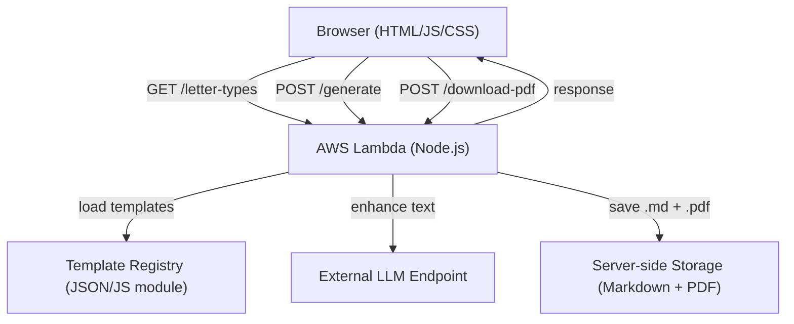

# Design Document: Letter Generator App

## Overview

The Letter Generator App is a web application that enables users to generate professional letters by selecting a letter type, filling out a dynamic form, and receiving a polished, AI-enhanced letter. The system uses a server-side template engine with `{{placeholder}}` substitution, optionally enhances the output via an external LLM endpoint, and delivers the result as a preview with copy and PDF download options. All generated letters are persisted server-side in both Markdown and PDF formats.

The architecture is designed around an extensible Template Registry so new letter types can be added by registering a new entry — no changes to core routing or frontend logic are required.

### Key Design Goals

- Extensible template registry: new letter types require zero changes to core logic
- Clean separation between frontend (HTML/JS/CSS), API (Lambda), and storage
- Graceful LLM fallback: 30-second timeout with transparent user notification
- Idempotent template rendering: same inputs always produce the same output

---

## Architecture



### Request Flow

1. On page load, the browser calls `GET /letter-types` to populate the letter type selector.
2. When the user selects a letter type, the frontend renders the form from the returned `Form_Schema`.
3. On form submit, the browser calls `POST /generate` with the letter type ID and field values.
4. Lambda runs the Template Engine to substitute placeholders, then calls the LLM endpoint (30s timeout).
5. Lambda saves the rendered letter as `.md` and `.pdf` to the Storage folder.
6. Lambda returns the (optionally enhanced) letter text to the browser.
7. The browser displays the Letter Preview. The user can copy to clipboard or trigger `POST /download-pdf`.

---

## Components and Interfaces

### Frontend (HTML/JS/CSS)

Single-page application with no framework dependency.

- `index.html` — app shell
- `app.js` — orchestrates UI state, API calls, event handlers
- `style.css` — layout and visual styling

Responsibilities:
- Render letter type selector from API response
- Dynamically build form fields from `Form_Schema`
- Validate required fields client-side before submission
- Show loading indicator during API calls
- Display Letter Preview with copy-to-clipboard and download actions
- Show error messages from API responses

### API Layer (AWS Lambda, Node.js)

Single Lambda function with path-based routing.

```
GET  /letter-types     → listLetterTypes()
POST /generate         → generateLetter()
POST /download-pdf     → downloadPdf()
```

Modules:
- `handler.js` — entry point, routes requests
- `templateEngine.js` — placeholder substitution logic
- `llmClient.js` — LLM endpoint integration with timeout
- `pdfGenerator.js` — converts letter text to PDF binary
- `storage.js` — saves Markdown and PDF files to disk
- `registry.js` — loads and exposes the Template Registry

### Template Registry

A static module (e.g., `templates/index.js`) that exports an array of `LetterTypeDefinition` objects. Adding a new letter type means adding a new entry to this array — nothing else changes.

### LLM Client

Wraps the external GenAI endpoint call with a 30-second `AbortController` timeout. On timeout or error, returns `null` so the caller falls back to the raw substituted text.

### PDF Generator

Uses a Node.js PDF library (e.g., `pdfkit`) to render letter text into a PDF buffer. Handles font, margins, and line wrapping.

### Storage

Writes files to a configured local folder path. File naming convention:

```
{letter_type_id}_{UTC_ISO_timestamp}.md
{letter_type_id}_{UTC_ISO_timestamp}.pdf
```

Creates the folder if it does not exist.

---

## Data Models

### LetterTypeDefinition

Represents a single entry in the Template Registry.

```typescript
interface FieldDefinition {
  key: string;          // placeholder key, e.g. "institution_name"
  label: string;        // human-readable label, e.g. "Institution Name"
  required: boolean;
}

interface LetterTypeDefinition {
  id: string;           // unique identifier, e.g. "event-hosting-request"
  displayName: string;  // e.g. "Event Hosting Request"
  template: string;     // letter text with {{placeholder}} tokens
  fields: FieldDefinition[];
}
```

### API Request/Response Shapes

#### GET /letter-types → 200

```json
{
  "letterTypes": [
    {
      "id": "event-hosting-request",
      "displayName": "Event Hosting Request",
      "fields": [
        { "key": "institution_name", "label": "Institution Name", "required": true },
        ...
      ]
    }
  ]
}
```

#### POST /generate → 200

Request:
```json
{
  "letterTypeId": "event-hosting-request",
  "fields": {
    "institution_name": "City Hall",
    "facility_name": "Main Auditorium",
    ...
  }
}
```

Response:
```json
{
  "letterText": "Dear ...",
  "llmEnhanced": true
}
```

#### POST /download-pdf → 200

Request:
```json
{
  "letterText": "Dear ..."
}
```

Response: `application/pdf` binary stream with `Content-Disposition: attachment`.

#### Error Response (4xx / 5xx)

```json
{
  "error": "Missing required field: institution_name"
}
```

### Internal: RenderResult

```typescript
type RenderResult =
  | { ok: true; text: string }
  | { ok: false; missingKeys: string[] };
```

---

## Correctness Properties

*A property is a characteristic or behavior that should hold true across all valid executions of a system — essentially, a formal statement about what the system should do. Properties serve as the bridge between human-readable specifications and machine-verifiable correctness guarantees.*

### Property 1: Form fields match schema

*For any* letter type in the registry, the form rendered for that letter type must contain exactly the fields defined in its `Form_Schema` — no more, no fewer.

**Validates: Requirements 1.2, 2.1**

---

### Property 2: Form cleared on letter type change

*For any* sequence of letter type selections, switching from one letter type to another must result in all form field values being empty.

**Validates: Requirements 1.3**

---

### Property 3: Required field validation rejects incomplete submissions

*For any* letter type and any submission where at least one required field is empty or whitespace-only, the system must reject the submission and return an error identifying the missing fields.

**Validates: Requirements 2.3, 2.4**

---

### Property 4: Placeholder substitution completeness

*For any* template string and any map of field values where every placeholder key has a corresponding value, the Template Engine must return a rendered string containing no remaining `{{...}}` tokens.

**Validates: Requirements 5.1, 3.2, 4.2**

---

### Property 5: Case-sensitive placeholder matching

*For any* template containing a placeholder `{{Key}}` and a field map that only supplies a value for `key` (lowercase), the Template Engine must treat `{{Key}}` as unresolved and return an error for that key.

**Validates: Requirements 5.2**

---

### Property 6: Error lists all unresolved placeholders

*For any* template with one or more placeholders that have no corresponding value in the field map, the Template Engine must return an error that includes every unresolved placeholder key.

**Validates: Requirements 5.4, 3.3, 4.3**

---

### Property 7: Template rendering is idempotent

*For any* template and field-value map, rendering the template twice with the same inputs must produce an identical result to rendering it once.

**Validates: Requirements 5.5**

---

### Property 8: Line breaks preserved in preview

*For any* letter text containing newline characters, the rendered Letter Preview must preserve those line breaks in the displayed output.

**Validates: Requirements 7.2**

---

### Property 9: Both storage files saved on successful generation

*For any* successful letter generation, the Storage folder must contain both a `.md` file and a `.pdf` file for that letter, with content matching the rendered letter text.

**Validates: Requirements 9.1, 9.2**

---

### Property 10: Storage filename matches naming convention

*For any* generated letter, the filenames of the stored Markdown and PDF files must match the pattern `{letter_type_id}_{UTC_ISO_timestamp}.{ext}`.

**Validates: Requirements 9.3**

---

### Property 11: Registry entries are structurally complete

*For any* entry in the Template Registry, it must have a non-empty unique `id`, a non-empty `displayName`, a non-empty `template` string, and at least one field definition — each with a non-empty `key`, `label`, and a boolean `required`.

**Validates: Requirements 10.3**

---

### Property 12: Registry extensibility — new entry appears in API response

*For any* new `LetterTypeDefinition` added to the Template Registry array, a subsequent call to `GET /letter-types` must include that letter type in the response without any other code changes.

**Validates: Requirements 10.2**

---

### Property 13: Invalid API requests return HTTP 400

*For any* request to any API endpoint that is missing required parameters or contains invalid values, the API must return an HTTP 400 response with a non-empty error message.

**Validates: Requirements 11.4**

---

## Error Handling

| Scenario | Behavior |
|---|---|
| Required form field empty on submit | Client-side validation blocks submission; error message lists missing fields |
| Placeholder key missing from field map | Template Engine returns `RenderResult { ok: false, missingKeys: [...] }`; API returns HTTP 400 |
| LLM endpoint timeout (>30s) | `llmClient` returns `null`; API falls back to raw substituted text; response includes `llmEnhanced: false` |
| LLM endpoint HTTP error | Same fallback as timeout |
| PDF generation failure | `pdfGenerator` throws; API catches and returns HTTP 500 with descriptive message |
| Storage write failure | `storage` throws; API catches and returns HTTP 500 with descriptive message |
| Storage folder missing | `storage.save()` calls `fs.mkdirSync(path, { recursive: true })` before writing |
| Unknown letter type ID in POST /generate | API returns HTTP 400: "Unknown letter type: {id}" |
| Malformed JSON request body | Lambda runtime / API Gateway returns HTTP 400 |
| Internal unhandled exception | Top-level try/catch in `handler.js` returns HTTP 500 |

---

## Testing Strategy

### Dual Testing Approach

Both unit tests and property-based tests are required. They are complementary:

- **Unit tests** cover specific examples, integration points, and error conditions
- **Property-based tests** verify universal properties across many generated inputs

### Property-Based Testing

Use **fast-check** (JavaScript) as the property-based testing library.

Each property test must run a minimum of **100 iterations**.

Each test must include a comment tag in the format:

```
// Feature: letter-generator-app, Property {N}: {property_text}
```

One property-based test per correctness property defined above.

| Property | Test Description |
|---|---|
| P1: Form fields match schema | Generate random registry entries; verify rendered form fields equal schema fields |
| P2: Form cleared on type change | Generate two random letter type selections; verify all fields empty after switch |
| P3: Required field validation | Generate submissions with at least one required field empty; verify rejection |
| P4: Placeholder substitution completeness | Generate random templates + complete field maps; verify no `{{...}}` remain |
| P5: Case-sensitive matching | Generate templates with mixed-case keys; verify case mismatch is unresolved |
| P6: Error lists all unresolved keys | Generate templates with partial field maps; verify all missing keys appear in error |
| P7: Idempotence | Generate random templates + fields; verify render(render(t,f),f) == render(t,f) |
| P8: Line break preservation | Generate letter text with random newlines; verify preview preserves them |
| P9: Both files saved | Generate a letter; verify both .md and .pdf exist in storage with correct content |
| P10: Filename convention | Generate letters; verify filenames match `{id}_{timestamp}.{ext}` pattern |
| P11: Registry completeness | Generate registry entries; verify all required structural fields are present |
| P12: Registry extensibility | Add a random entry to registry; verify it appears in GET /letter-types response |
| P13: Invalid requests return 400 | Generate invalid requests for each endpoint; verify HTTP 400 response |

### Unit Tests

Focus on specific examples, edge cases, and integration points:

- `GET /letter-types` returns correct shape with all registered types
- `POST /generate` with valid Event Hosting Request fields returns rendered text
- `POST /generate` with valid Support Request fields returns rendered text
- `POST /download-pdf` returns `application/pdf` with correct headers
- LLM timeout fallback: mock LLM to delay >30s, verify raw text returned with `llmEnhanced: false`
- LLM error fallback: mock LLM to throw, verify same fallback behavior
- Storage folder auto-creation: run storage with non-existent path, verify folder created
- Storage write failure: mock `fs.writeFile` to throw, verify HTTP 500 returned
- PDF generation failure: mock pdfkit to throw, verify HTTP 500 returned
- Copy-to-clipboard: verify clipboard contains full letter text after action
- Empty template renders to empty string without error
- Template with no placeholders returns template unchanged
