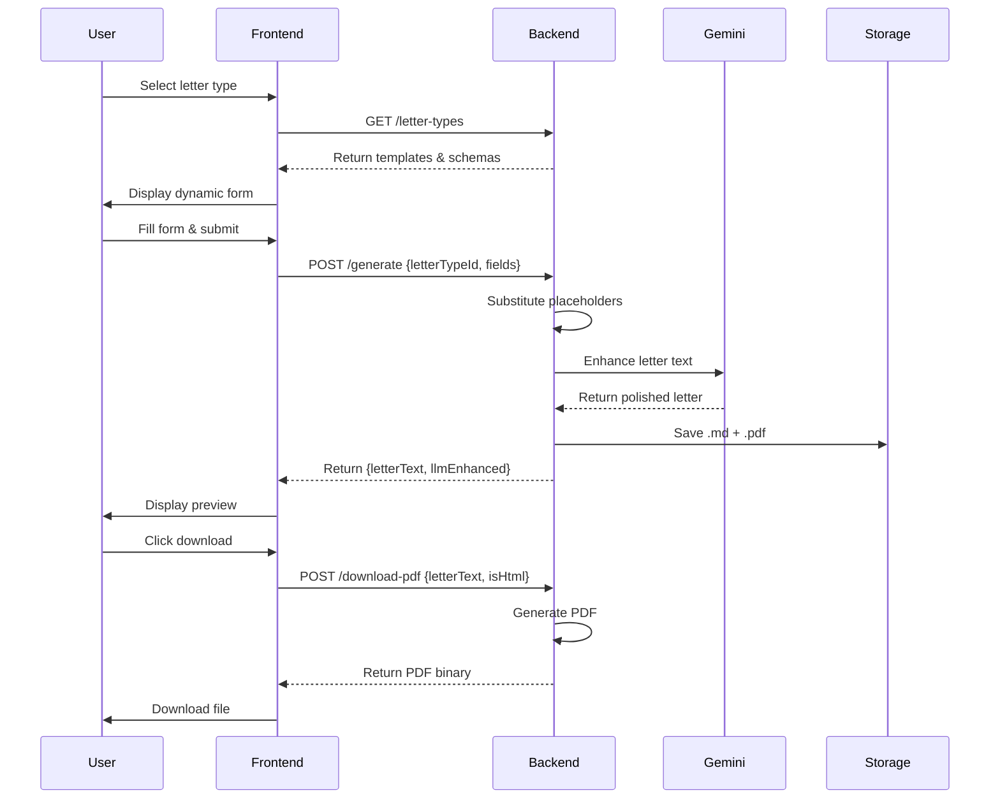
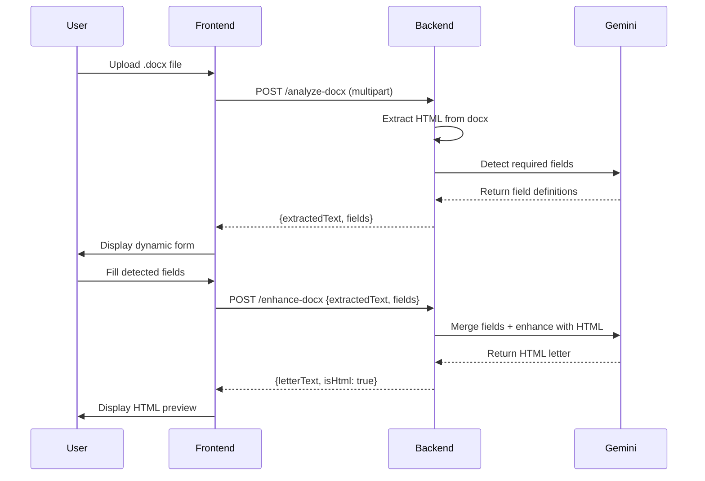

# Letter Generator App - Complete Project Documentation

## 📋 Table of Contents
1. [Project Overview](#project-overview)
2. [Features](#features)
3. [Architecture](#architecture)
4. [Technology Stack](#technology-stack)
5. [Project Structure](#project-structure)
6. [Setup & Installation](#setup--installation)
7. [How It Works](#how-it-works)
8. [API Documentation](#api-documentation)
9. [Component Details](#component-details)
10. [Configuration](#configuration)
11. [Testing](#testing)
12. [Future Enhancements](#future-enhancements)

---

## 🎯 Project Overview

The **Letter Generator App** is a professional web application that helps users create formal business letters using AI-powered templates. Users can either:
- Select from predefined letter templates (Event Hosting Request, Support Request)
- Upload their own .docx files and let AI analyze and enhance them

The system uses Google Gemini AI to polish letters into professional business writing, preserves formatting (bold, italic, etc.), and generates downloadable PDFs.

### Key Capabilities
- ✅ Dynamic form generation based on letter type
- ✅ AI-powered letter enhancement using Google Gemini 2.5 Flash
- ✅ Upload custom .docx templates with AI field detection
- ✅ Preserve formatting (bold, italic) from original documents
- ✅ Real-time letter preview with HTML rendering
- ✅ Copy to clipboard functionality
- ✅ PDF generation with formatting preservation
- ✅ Server-side storage of all generated letters
- ✅ Modern, responsive UI with modal forms
- ✅ Regenerate letters with same inputs for different AI variations

---

## ✨ Features

### 1. Template-Based Letter Generation
- **Predefined Templates**: Event Hosting Request, Support Request Letter
- **Dynamic Forms**: Forms automatically generated from template schemas
- **Required Field Validation**: Client-side validation before submission
- **AI Enhancement**: Google Gemini polishes letters for professional tone

### 2. Custom Document Upload
- **DOCX Upload**: Users can upload their own .docx files
- **AI Field Detection**: Gemini analyzes the document and identifies required fields
- **Smart Form Generation**: Dynamic form created based on AI-detected fields
- **Formatting Preservation**: Bold, italic, and other formatting preserved from original

### 3. Letter Preview & Actions
- **Live Preview**: See the generated letter before downloading
- **HTML Rendering**: Proper formatting display for enhanced letters
- **Copy to Clipboard**: One-click copy of letter text
- **PDF Download**: Generate and download formatted PDF
- **Regenerate**: Get a fresh AI variation with same inputs

### 4. Modern UI/UX
- **Modal Forms**: Clean modal-based form interface
- **Loading States**: Spinner overlay during processing
- **Error Toasts**: Slide-in error notifications
- **Responsive Design**: Works on desktop and mobile
- **Smooth Animations**: Professional transitions and hover effects

---

## 🏗️ Architecture

```
┌─────────────────────────────────────────────────────────────┐
│                         Browser                              │
│  ┌──────────────┐  ┌──────────────┐  ┌──────────────┐     │
│  │  index.html  │  │   app.js     │  │  style.css   │     │
│  └──────────────┘  └──────────────┘  └──────────────┘     │
└─────────────────────────────────────────────────────────────┘
                            │
                            │ HTTP/REST API
                            ▼
┌─────────────────────────────────────────────────────────────┐
│                    Node.js Server                            │
│  ┌──────────────────────────────────────────────────────┐  │
│  │                    server.js                          │  │
│  │  • Static file serving                                │  │
│  │  • API routing                                        │  │
│  │  • Multipart form handling (docx upload)             │  │
│  └──────────────────────────────────────────────────────┘  │
│                            │                                 │
│  ┌──────────────────────────────────────────────────────┐  │
│  │                   handler.js                          │  │
│  │  • /letter-types  → listLetterTypes()                │  │
│  │  • /generate      → generateLetter()                 │  │
│  │  • /download-pdf  → downloadPdf()                    │  │
│  │  • /analyze-docx  → handleAnalyzeDocx()              │  │
│  │  • /enhance-docx  → handleEnhanceDocx()              │  │
│  └──────────────────────────────────────────────────────┘  │
│                            │                                 │
│  ┌────────────┬────────────┬────────────┬────────────┐    │
│  │ registry.js│templateEng │ llmClient  │pdfGenerator│    │
│  │            │ine.js      │ .js        │.js         │    │
│  │ Template   │ Placeholder│ Gemini API │ HTML→PDF   │    │
│  │ Registry   │ Substitut. │ Integration│ Conversion │    │
│  └────────────┴────────────┴────────────┴────────────┘    │
│                            │                                 │
│  ┌──────────────────────────────────────────────────────┐  │
│  │                   storage.js                          │  │
│  │  Saves .md and .pdf files to backend/storage/        │  │
│  └──────────────────────────────────────────────────────┘  │
└─────────────────────────────────────────────────────────────┘
                            │
                            ▼
┌─────────────────────────────────────────────────────────────┐
│              External Services                               │
│  ┌──────────────────────────────────────────────────────┐  │
│  │  Google Gemini 2.5 Flash API                         │  │
│  │  • Letter enhancement                                 │  │
│  │  • Field detection from docx                         │  │
│  │  • HTML formatting generation                        │  │
│  └──────────────────────────────────────────────────────┘  │
└─────────────────────────────────────────────────────────────┘
```

### Data Flow

#### Template Letter Flow:
1. User selects letter type → Frontend fetches schema from `/letter-types`
2. User fills form → Frontend sends to `/generate`
3. Backend substitutes placeholders → Sends to Gemini for enhancement
4. Backend saves .md + .pdf → Returns enhanced text
5. Frontend displays preview → User can copy or download PDF

#### Custom DOCX Flow:
1. User uploads .docx → Frontend sends to `/analyze-docx`
2. Backend extracts HTML from docx → Sends to Gemini for field detection
3. Gemini returns required fields → Frontend generates dynamic form
4. User fills detected fields → Frontend sends to `/enhance-docx`
5. Backend merges fields with template → Gemini enhances with HTML formatting
6. Frontend displays HTML preview → User can download formatted PDF

---

## 🛠️ Technology Stack

### Frontend
- **HTML5**: Semantic markup
- **CSS3**: Modern styling with gradients, animations, flexbox
- **Vanilla JavaScript**: No framework dependencies
- **Fetch API**: HTTP requests to backend

### Backend
- **Node.js**: Runtime environment
- **Express-style routing**: Custom HTTP server with path-based routing
- **Mammoth**: DOCX to HTML conversion
- **html-pdf-node**: HTML to PDF conversion (uses Puppeteer)
- **pdfkit**: Fallback PDF generation for plain text
- **dotenv**: Environment variable management

### AI/ML
- **Google Gemini 2.5 Flash** (Primary Option):
  - Letter enhancement
  - Field detection
  - HTML formatting generation
  - Free tier: 15 RPM, 1,500 requests/day

- **Groq with Llama 3.3 70B** (Recommended - Higher Limits):
  - Letter enhancement
  - Field detection  
  - HTML formatting generation
  - Free tier: 30 RPM, 14,400 requests/day
  - Ultra-fast inference with LPU technology

- **Automatic Fallback**: System tries primary provider, falls back to secondary if it fails

### Testing
- **Jest**: Unit testing framework
- **fast-check**: Property-based testing library

---

## 📁 Project Structure

```
letter-generator-app/
├── .gitignore                          # Git ignore rules
├── .kiro/                              # Kiro IDE spec files
│   └── specs/
│       └── letter-generator-app/
│           ├── .config.kiro            # Spec configuration
│           ├── requirements.md         # Detailed requirements
│           ├── design.md               # Architecture & design
│           └── tasks.md                # Implementation tasks
│
├── backend/                            # Backend Node.js application
│   ├── .env                            # Environment variables (API keys)
│   ├── package.json                    # Dependencies & scripts
│   ├── package-lock.json               # Locked dependency versions
│   │
│   ├── server.js                       # HTTP server entry point
│   ├── handler.js                      # API route handlers
│   ├── registry.js                     # Template registry loader
│   ├── templateEngine.js               # Placeholder substitution
│   ├── llmClient.js                    # Gemini API integration
│   ├── pdfGenerator.js                 # PDF generation (HTML & plain text)
│   ├── storage.js                      # File storage management
│   │
│   ├── templates/                      # Letter templates
│   │   └── index.js                    # Template definitions
│   │
│   ├── storage/                        # Generated letters storage
│   │   ├── *.md                        # Markdown versions
│   │   └── *.pdf                       # PDF versions
│   │
│   ├── handler.test.js                 # Handler unit tests
│   ├── templateEngine.test.js          # Template engine tests
│   └── node_modules/                   # Dependencies
│
└── frontend/                           # Frontend web application
    ├── index.html                      # Main HTML page
    ├── app.js                          # Frontend JavaScript logic
    └── style.css                       # Styling & animations
```

---

## 🚀 Setup & Installation

### Prerequisites
- **Node.js** v18+ (includes built-in fetch support)
- **npm** (comes with Node.js)
- **Google Gemini API Key** (free tier available)

### Configuration Steps

1. **Clone or download the project**
   ```bash
   cd letter-generator-app
   ```

2. **Install backend dependencies**
   ```bash
   cd backend
   npm install
   ```

3. **Configure environment variables**
   Create `backend/.env` file:
   ```env
   # Choose your AI provider (groq recommended for higher limits)
   LLM_PROVIDER=groq
   
   # Google Gemini API Key (optional if using Groq)
   GEMINI_API_KEY=your_gemini_key_here
   
   # Groq API Key (recommended - 10x more requests!)
   GROQ_API_KEY=your_groq_key_here
   
   PORT=3000
   STORAGE_PATH=./storage
   ```

   **Get API Keys:**
   - Groq (recommended): https://console.groq.com/keys
   - Gemini: https://makersuite.google.com/app/apikey

4. **Start the server**
   ```bash
   npm start
   ```

5. **Open in browser**
   Navigate to: `http://localhost:3000`

### Troubleshooting

**Issue**: `You have reached a rate limit` error
- **Cause**: Hit Gemini's free tier limit (1,500 requests/day)
- **Solution**: Switch to Groq (14,400 requests/day)
  1. Get Groq API key from https://console.groq.com
  2. Add to `backend/.env`: `GROQ_API_KEY=your_key`
  3. Set `LLM_PROVIDER=groq`
  4. Restart server
- **See**: `QUICK_START_GROQ.md` for detailed guide

**Issue**: `fetch failed` error when generating letters
- **Cause**: Network cannot reach AI provider
- **Solution**: 
  - Try switching providers (Groq ↔ Gemini)
  - Use mobile hotspot or VPN
  - Check firewall settings

**Issue**: PDF generation fails
- **Cause**: Missing Puppeteer dependencies
- **Solution**: Install system dependencies for Puppeteer (Chrome/Chromium)

---

## 🔄 How It Works

### 1. Template-Based Letter Generation



### 2. Custom DOCX Upload Flow



---

## 📡 API Documentation

### Base URL
```
http://localhost:3000
```

### Endpoints

#### 1. GET /letter-types
Get all available letter templates and their schemas.

**Response:**
```json
{
  "letterTypes": [
    {
      "id": "event-hosting-request",
      "displayName": "Event Hosting Request",
      "fields": [
        {
          "key": "institution_name",
          "label": "Institution Name",
          "required": true
        },
        ...
      ]
    }
  ]
}
```

#### 2. POST /generate
Generate a letter from a template.

**Request:**
```json
{
  "letterTypeId": "event-hosting-request",
  "fields": {
    "institution_name": "City Hall",
    "facility_name": "Main Auditorium",
    "event_name": "Tech Conference 2026",
    ...
  }
}
```

**Response:**
```json
{
  "letterText": "Dear Administrator,\n\nI am writing...",
  "llmEnhanced": true
}
```

#### 3. POST /download-pdf
Generate and download a PDF from letter text.

**Request:**
```json
{
  "letterText": "Dear Administrator...",
  "isHtml": false
}
```

**Response:**
- Content-Type: `application/pdf`
- Content-Disposition: `attachment`
- Body: PDF binary data

#### 4. POST /analyze-docx
Upload and analyze a .docx file to detect required fields.

**Request:**
- Content-Type: `multipart/form-data`
- Body: File upload with key `file`

**Response:**
```json
{
  "extractedText": "<p>Dear...</p>",
  "fields": [
    {
      "key": "recipient_name",
      "label": "Recipient Name",
      "required": true
    },
    ...
  ]
}
```

#### 5. POST /enhance-docx
Enhance a docx template with user-provided field values.

**Request:**
```json
{
  "extractedText": "<p>Dear {{recipient_name}}...</p>",
  "fields": {
    "recipient_name": "John Smith",
    "date": "March 23, 2026"
  }
}
```

**Response:**
```json
{
  "letterText": "<p>Dear <strong>John Smith</strong>...</p>",
  "llmEnhanced": true,
  "isHtml": true
}
```

### Error Responses

**400 Bad Request:**
```json
{
  "error": "Missing required parameter: letterTypeId"
}
```

**500 Internal Server Error:**
```json
{
  "error": "PDF generation failed: ..."
}
```

---

## 🧩 Component Details

### Backend Components

#### server.js
- HTTP server using Node.js `http` module
- Serves static frontend files
- Routes API requests to handlers
- Handles multipart form data for file uploads
- CORS headers for development

#### handler.js
- `listLetterTypes()`: Returns all templates from registry
- `generateLetter()`: Template substitution + AI enhancement + storage
- `downloadPdf()`: Converts letter text to PDF binary

#### registry.js
- Loads template definitions from `templates/index.js`
- Provides `getAll()` and `getById()` methods
- Extensible: add new templates without code changes

#### templateEngine.js
- `render(template, fields)`: Substitutes `{{placeholder}}` with values
- Returns `{ok: true, text}` or `{ok: false, missingKeys}`
- Case-sensitive placeholder matching
- Idempotent: same inputs always produce same output

#### llmClient.js
- `enhance(text)`: Main function that routes to configured provider
- `enhanceWithGemini(text)`: Sends text to Gemini for professional polishing
- `enhanceWithGroq(text)`: Sends text to Groq for professional polishing
- Returns enhanced text or `null` on error/timeout
- **Multi-Provider Support**:
  - Primary provider set via `LLM_PROVIDER` env variable
  - Automatic fallback to secondary provider on failure
  - 30-second timeout per provider
- **Gemini**: Uses `gemini-2.5-flash` model
- **Groq**: Uses `llama-3.3-70b-versatile` model (70B parameters)
- Configurable via environment variables

#### pdfGenerator.js
- `generate(content, isHtml)`: Converts text/HTML to PDF
- **HTML mode**: Uses `html-pdf-node` (Puppeteer) for formatted PDFs
  - Preserves bold, italic, lists, etc.
  - Times New Roman font, proper margins
- **Plain text mode**: Uses `pdfkit` for simple text PDFs
- Auto-detects HTML by checking for tags

#### storage.js
- `save(letterTypeId, text, pdfBuffer)`: Saves .md and .pdf files
- Filename format: `{letterTypeId}_{timestamp}.{ext}`
- Creates storage directory if missing
- Returns file paths

### Frontend Components

#### index.html
- Single-page application structure
- Modal containers for forms
- Preview section with action buttons
- Loading overlay and error toast

#### app.js
- **State Management**:
  - `letterTypes`: Available templates
  - `currentLetterText`: Current letter content
  - `currentLetterIsHtml`: Whether content is HTML
  - `lastGenerateContext`: For regeneration
  - `docxExtractedText`: Uploaded docx content

- **Key Functions**:
  - `loadLetterTypes()`: Fetches templates on page load
  - `displayPreview(content, llmEnhanced, isHtml)`: Shows letter preview
  - `showLoading()` / `hideLoading()`: Loading state
  - `showError(msg)`: Error toast notifications
  - `openModal()` / `closeModal()`: Modal management

- **Event Handlers**:
  - Template selection → Dynamic form generation
  - Form submission → Letter generation
  - DOCX upload → Field detection
  - Copy button → Clipboard API
  - Download button → PDF generation
  - Regenerate button → Fresh AI variation

#### style.css
- Modern gradient background (purple theme)
- Card-based layout with shadows
- Modal styling with backdrop blur
- Loading spinner animation
- Error toast slide-in animation
- Responsive design (mobile-friendly)
- Smooth transitions and hover effects

---

## ⚙️ Configuration

### Environment Variables

Create `backend/.env`:

```env
# ============================================
# AI Provider Configuration
# ============================================
# Choose your LLM provider: 'gemini' or 'groq' (default: gemini)
# The system will automatically fallback to the other provider if one fails
LLM_PROVIDER=groq

# Google Gemini API Key
# Get from: https://makersuite.google.com/app/apikey
# Free tier: 15 RPM, 1,500 requests/day
GEMINI_API_KEY=your_gemini_key_here

# Groq API Key (RECOMMENDED - Higher limits!)
# Get from: https://console.groq.com
# Free tier: 30 RPM, 14,400 requests/day
GROQ_API_KEY=your_groq_key_here

# ============================================
# Server Configuration
# ============================================
# Optional: Server port (default: 3000)
PORT=3000

# Optional: Storage path (default: ./storage)
STORAGE_PATH=./storage
```

### AI Provider Comparison

| Feature | Gemini 2.5 Flash | Groq (Llama 3.3 70B) |
|---------|------------------|----------------------|
| **Requests/Minute** | 15 | 30 (2x more) |
| **Requests/Day** | 1,500 | 14,400 (10x more) |
| **Speed** | Fast | Ultra Fast |
| **Quality** | Excellent | Excellent |
| **Context Window** | 1M tokens | 8K tokens |
| **Best For** | Long documents | Quick generation |
| **Setup** | API key only | API key only |
| **Cost** | Free | Free |

### Choosing a Provider

**Use Groq if:**
- ✅ You need higher rate limits (14,400 vs 1,500 requests/day)
- ✅ You want faster generation (2-3x faster)
- ✅ You're hitting Gemini rate limits
- ✅ You generate many letters per day

**Use Gemini if:**
- ✅ You have very long documents (>8K tokens)
- ✅ You prefer Google's infrastructure
- ✅ Groq is experiencing downtime

**Use Both (Recommended):**
- ✅ Set both API keys in `.env`
- ✅ System automatically falls back if primary fails
- ✅ Maximum reliability and uptime
- ✅ Best of both worlds

### Quick Setup Guides

- **Groq Setup**: See `QUICK_START_GROQ.md` (2 minutes)
- **Rate Limit Solution**: See `RATE_LIMIT_SOLUTION.md`
- **Detailed Groq Guide**: See `GROQ_SETUP_GUIDE.md`

### Adding New Letter Templates

Edit `backend/templates/index.js`:

```javascript
const templates = [
  // Existing templates...
  
  // Add new template
  {
    id: 'recommendation-letter',
    displayName: 'Recommendation Letter',
    template: `Dear {{recipient_name}},

I am writing to recommend {{candidate_name}} for {{position}}.

{{recommendation_body}}

Sincerely,
{{recommender_name}}`,
    fields: [
      { key: 'recipient_name', label: 'Recipient Name', required: true },
      { key: 'candidate_name', label: 'Candidate Name', required: true },
      { key: 'position', label: 'Position', required: true },
      { key: 'recommendation_body', label: 'Recommendation', required: true },
      { key: 'recommender_name', label: 'Your Name', required: true },
    ],
  },
];
```

No other code changes needed! The new template will automatically appear in the UI.

---

## 🧪 Testing

### Running Tests

```bash
cd backend
npm test
```

### Test Coverage

#### Unit Tests (`handler.test.js`, `templateEngine.test.js`)
- Template engine placeholder substitution
- Missing placeholder detection
- Case-sensitive matching
- API endpoint responses
- Error handling

#### Property-Based Tests
- Uses `fast-check` library
- 100+ iterations per property
- Tests universal properties across random inputs
- Validates correctness properties from design doc

### Test Examples

```javascript
// Unit test
test('renders template with all fields provided', () => {
  const template = 'Hello {{name}}, welcome to {{place}}!';
  const fields = { name: 'Alice', place: 'Wonderland' };
  const result = templateEngine.render(template, fields);
  expect(result.ok).toBe(true);
  expect(result.text).toBe('Hello Alice, welcome to Wonderland!');
});

// Property-based test
test('Property 7: Template rendering is idempotent', () => {
  fc.assert(
    fc.property(
      fc.record({
        template: fc.string(),
        fields: fc.dictionary(fc.string(), fc.string())
      }),
      ({ template, fields }) => {
        const result1 = templateEngine.render(template, fields);
        const result2 = templateEngine.render(template, fields);
        expect(result1).toEqual(result2);
      }
    ),
    { numRuns: 100 }
  );
});
```

---

## 🔮 Future Enhancements

### Planned Features
1. **User Authentication**: Save letters to user accounts
2. **Letter History**: Browse and reuse past letters
3. **Template Marketplace**: Share and download community templates
4. **Multi-language Support**: Generate letters in different languages
5. **Email Integration**: Send letters directly via email
6. **Collaborative Editing**: Multiple users edit same letter
7. **Version Control**: Track letter revisions
8. **Advanced Formatting**: Tables, images, headers/footers in PDFs
9. **Batch Generation**: Generate multiple letters at once
10. **Analytics**: Track letter generation metrics

### Technical Improvements
- Migrate to TypeScript for type safety
- Add Redis caching for Gemini responses
- Implement rate limiting for API endpoints
- Add WebSocket for real-time collaboration
- Deploy to AWS Lambda for serverless architecture
- Add CI/CD pipeline with GitHub Actions
- Implement comprehensive E2E tests with Playwright
- Add monitoring and logging (e.g., Sentry, CloudWatch)

---

## 📝 License

This project is for educational and demonstration purposes.

---

## 👥 Contributors

Built with Kiro AI Assistant

---

## 📞 Support

For issues or questions:
1. Check the troubleshooting section
2. Review the API documentation
3. Inspect browser console for errors
4. Check backend logs for server errors

---

**Last Updated**: March 23, 2026
**Version**: 1.0.0
